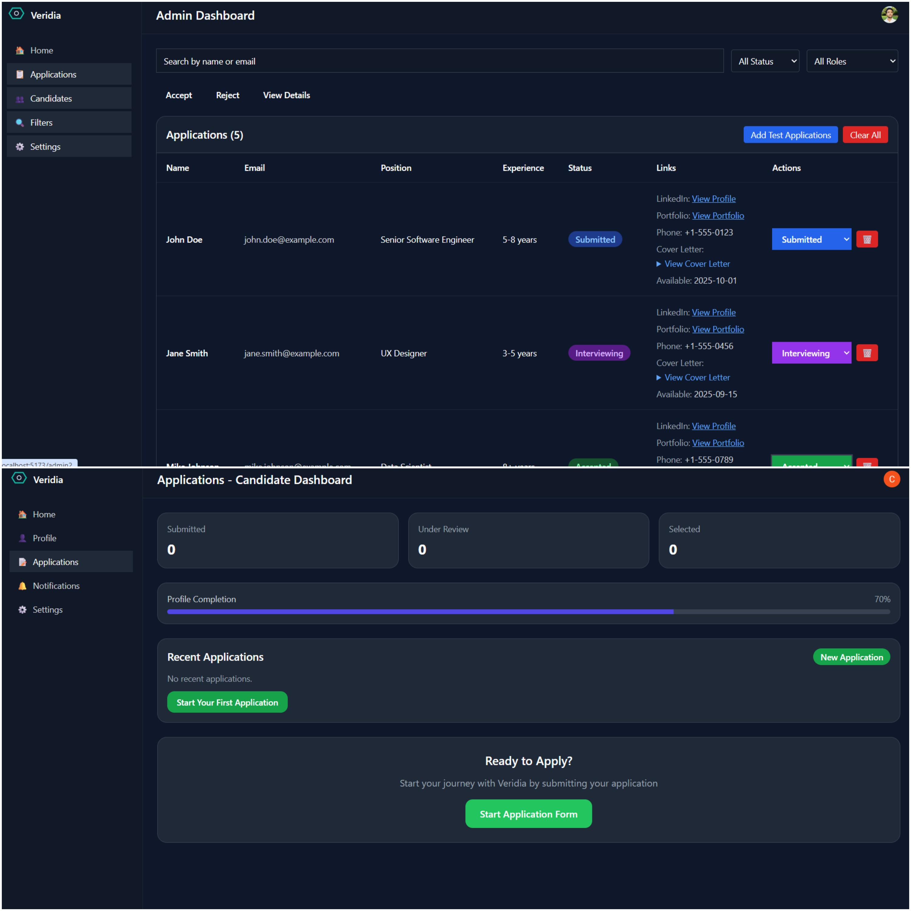
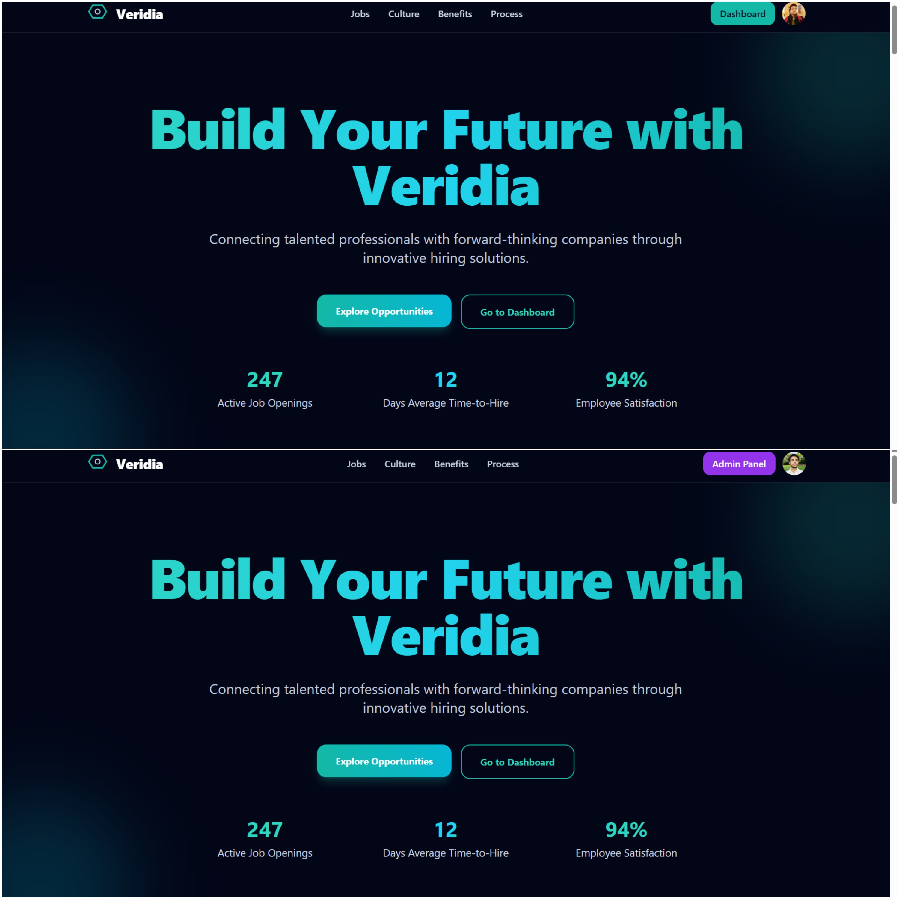
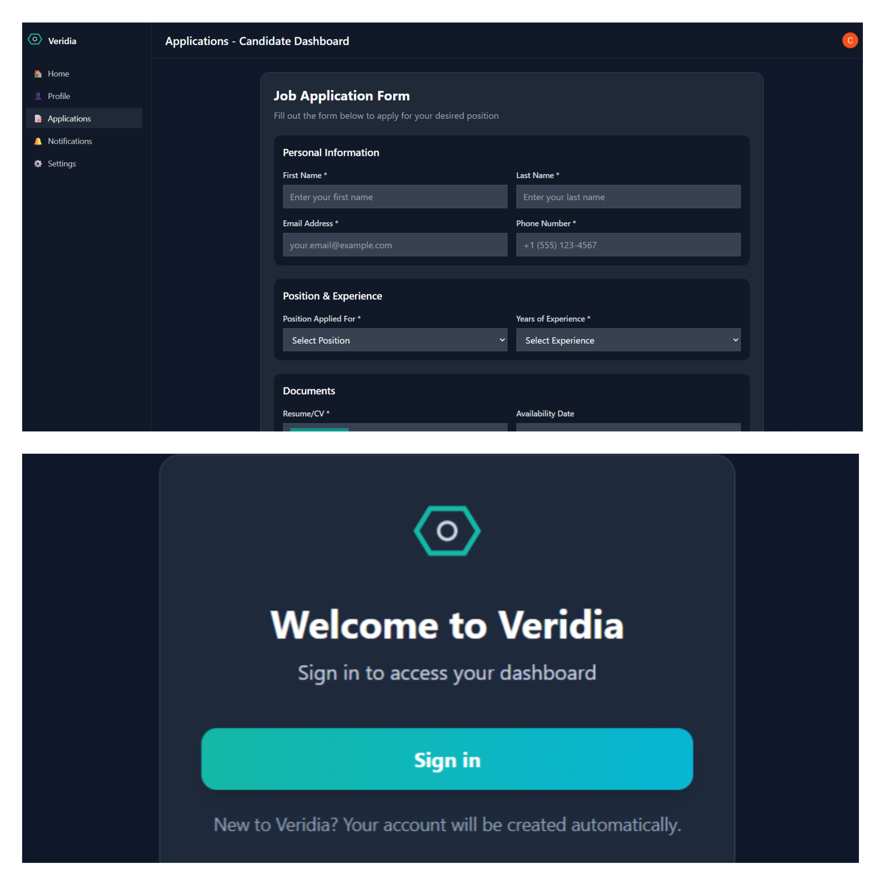

# Veridia_Hiring_Plateform

## 🚀 Veridia Hiring Platform

A modern, full-stack hiring platform built with React, Node.js, Express, and MongoDB. Features role-based authentication with Clerk, candidate management, and admin dashboard functionality.

### 🔗 Live Demo

**🌐  Demo Link:** [https://veridia-hiring-plateform.vercel.app](https://veridia-hiring-plateform.vercel.app)

### 🛠️ Tech Stack

**Frontend:**
- React 18
- Tailwind CSS
- Clerk Authentication
- React Router DOM

**Backend:**
- Node.js
- Express.js
- MongoDB with Mongoose
- Clerk SDK for Node.js
- CORS support

### 📦 Features

- 🔐 **Authentication System** - Clerk-based user management
- 👥 **Role-Based Access** - Admin and regular user roles
- 📝 **Candidate Management** - Application submission and tracking
- 📊 **Admin Dashboard** - Manage applications and candidates
- 📱 **Responsive Design** - Mobile-first approach
- 🎨 **Modern UI** - Dark theme with beautiful animations

### 🚀 Deployment

1. **Deploy to Vercel:**
   ```bash
   cd client
   npm run build
   vercel --prod
   ```

2. **Configure Environment Variables:**
   - `VITE_CLERK_PUBLISHABLE_KEY` - Your Clerk publishable key
   - `VITE_API_BASE_URL` - Your Render backend URL (e.g., `https://your-backend.onrender.com/api`)

3. **Access Your App:**
   - Frontend: `https://your-project.vercel.app`
   - Connect to your Render backend API

### 📱 Screenshots

#### Admin Dashboard


#### Dashboard and Admin Dashboard


#### Form and Signup


### 🚀 Deployment

Deploy your backend to Render.com:
1. Create new Web Service on Render
2. Connect to GitHub: `Vaishnotiwari12/Veridia_Hiring_Plateform`
3. Root Directory: `./server`
4. Runtime: `Node`
5. Build Command: `npm install`
6. Start Command: `npm run dev`

### 📁 Project Structure

```
Veridia_Hiring_Plateform/
├── client/                 # React Frontend
│   ├── src/
│   │   ├── components/
│   │   ├── pages/
│   │   ├── layouts/
│   │   └── ...
│   └── public/
├── server/                 # Node.js Backend
│   ├── controllers/
│   ├── models/
│   ├── routes/
│   ├── config/
│   └── index.js
└── README.md
```

### 🎯 API Endpoints

- `POST /api/candidates` - Create candidate
- `GET /api/candidates` - Get user candidates
- `GET /api/candidates/admin/all` - Get all candidates (Admin)
- `DELETE /api/candidates/:id` - Delete candidate (Admin)
- `PUT /api/candidates/:id/status` - Update candidate status (Admin)

### 👥 Contributing

1. Fork the repository
2. Create your feature branch (`git checkout -b feature/amazing-feature`)
3. Commit your changes (`git commit -m 'Add some amazing feature'`)
4. Push to the branch (`git push origin feature/amazing-feature`)
5. Open a Pull Request

### 📄 License

This project is licensed under the ISC License.

### 👨‍💻 Author

**Vaishno Tiwari**
- Built with ❤️ for modern hiring processes
- Full-stack developer passionate about creating beautiful user experiences

---

⭐ **Star this repo** if you found it helpful!
